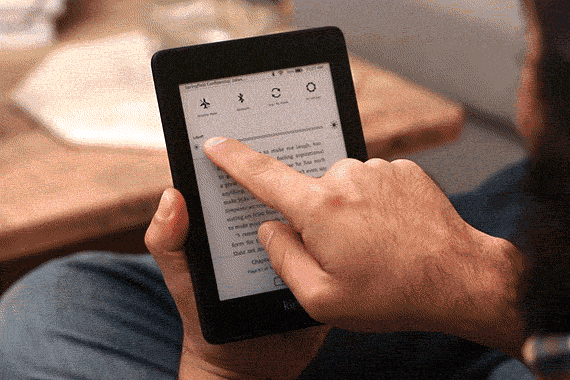

Aaaaah como seria bom pedir esse tipo de coisa para a Alexa e ela resolver, não seria? haha

Hey, Fellas, quanto tempo!? 

Estou aqui hoje pra falar da assistente virtual queridinha do mundo à fora: ALEXA.

Sei que muito de vocês já conhecem ela, mas irei falar um pouquinho: Alexa é uma assistente virtual criada pela Amazon, com o objetivo de facilitar as tarefas mais simples (algumas complexas) da gente.

A Alexa consegue interagir com muitos aparelhos da sua casa, caso eles também possuam tecnologia inteligente. Como por exemplo, lâmpadas, fechaduras, controles remotos, TVs, geladeiras e muito mais. Alguns desses aparelhos possuem compatibilidade nativa com a Alexa, outros precisam de adaptadores inteligentes para a conexão com ela.

Você pode pedir a Alexa desde uma previsão do tempo, ligar o ar condicionado, até pedir um ifood ou uber para você.

Eu, particulamente, uso muito a Alexa para acordar com uma novidade diária (desde que comprei ela deixei de acordar com despertadores barulhentos). Fora as dicas de receitas que peço a ela, e até traduções para diversos idiomas. E, a função mais usada: ouvir música! Nossa, você não precisa ficar procurando a música no celular mais, só pedir pra Alexa! Você pode conectar o Spotify, Amazon Music e muitos outros na Alexa.

Essa dica vai para os "Kinders": se você tiver um Kindle, você consegue pedir a Alex para poder ler seus livros digitais como se fossem audiobooks!

Legal, né? Além disso tudo, no app da Alexa você consegue encontrar várias skills para poder personalizar ainda mais sua Alexa.
A skill que mais uso é a de rotina. Posso configurar meu dia todinho nela. Um exemplo, toda vez que dou bom dia para Alexa ela liga a luz do quarto, me fala a previsão do tempo e me fala uma curiosidade do dia.

E aí? Vai comprar sua Alexa quando? NÃO ESTOU GANHANDO NADA COM ESSA DIVULGAÇÃO, VIU @AMAZON! FICA A DICA

Espero que você tenha gostado do post! Você também pode acompanhar as novidades no [instagram](http://instagram.com/techplatformdigital)

- Alexa, fala pra galera que o post acabou.
--- Bom, fellas, por hoje é isso! 
Até a próxima.