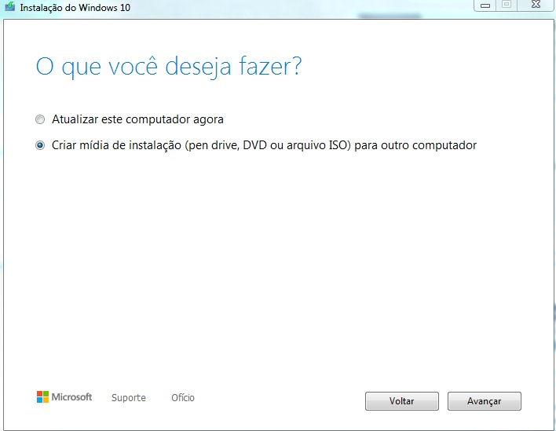
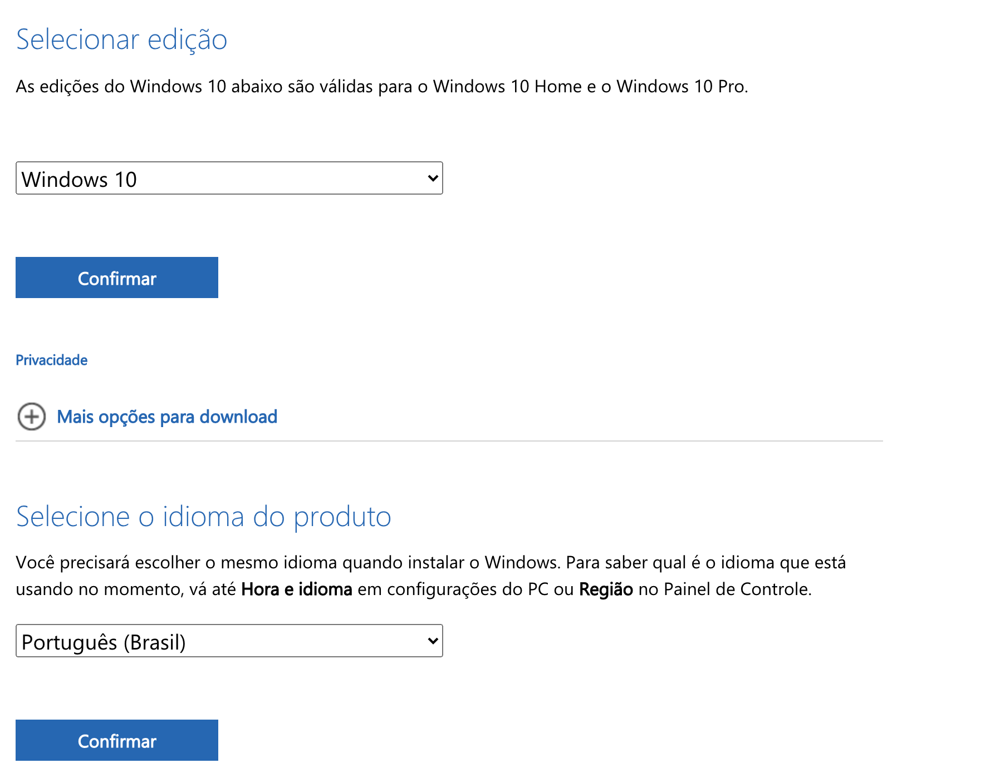
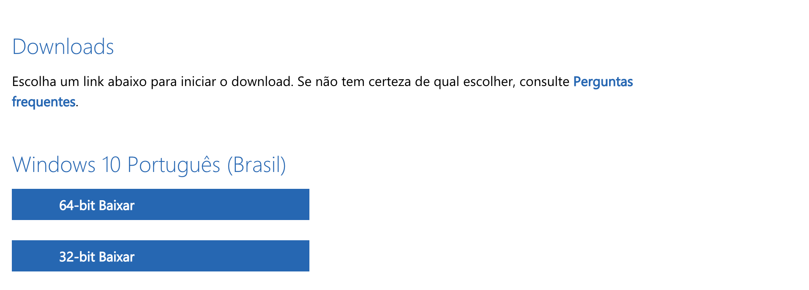
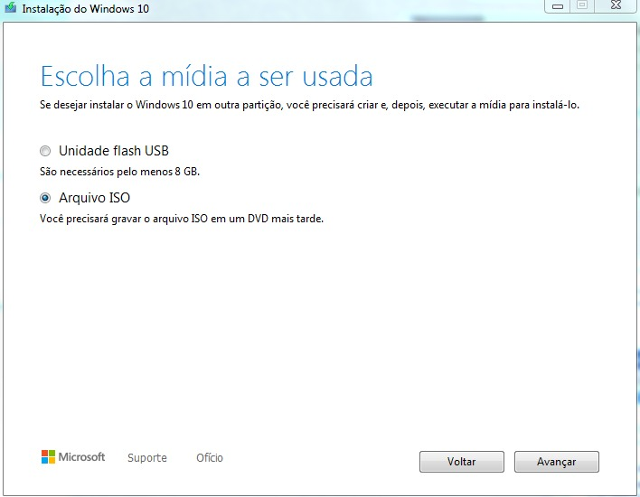

Hey, fellas! Tudo bem com vocês?

O post de hoje é para falar de um assunto que, para muitos, ainda é um mistério:

Como formatar um computador? Como instalar o Windows 10 ?

Se você já tem o Windows 10 instalado no seu computador, esse processo é mais fácil e simples. Hoje, irei explicar como você pode baixar o Windows e fazer toda a instalação. 

Primeiramente, você vai precisar de um pendrive com no mínimo 8GB, para baixar e instalar o Windows 10. Você também irá formatar o pendrive clicando com o botão direito do mouse e selecionando a opção "formatar" e escolhendo a opção "FAT32". PRONTO. Seu pendrive está pronto para a instalação.

## Instalando o Windows 10 

  Conecte o pendrive no computador.

  Acesse o [site da Microsoft](http://microsoft.com/pt-br/software-download/windows10ISO)

<em>Ferramenta Windows 10</em>

  Baixe a ferramenta e instale.

<em>Instalando a ferramenra</em>

  Aceite os termos e avance na criação da mída de instalação

Depois de instalar a ferramenta do Windows 10, continue os passos para download do Windows.

<em>Download do Windows</em>

  Confirme o software selecionado clicando em Confirmar.

  Selecione a versão do seu Windows. Dica: se você tiver mais de 4GB de RAM em seu computador, selecione a opção de 64-bit.

<em>Versão do Windows</em>

  Depois de selecionar a versão, você irá baixar e instalar na ferramenta como unidade flash.

<em>Selecionando o Windows na Ferramenta</em>

## Depois da instalação no pendrive

Agora que você já instalou o Windows 10 no pendrive, você pode reiniciar o computador e, quando aparecer o símbolo da marca do seu computador, pressione repetidas vezes a tecla F2.

A imagem de BIOS irá aparecer e você irá procurar a opção BOOT PRIORITIES, e deixar em primeiro lugar o seu pendrive, aquele que você instalou o Windows 10.

Salve e saia da tela, ela irá iniciar e ir para a tela de instalação do Windows. 

A instalação é bem intuitiva, então não se preocupe, você irá seguindos os passos e instalando seu Windows.

Pronto! O Windows está instalado. Você pode escolher configurações como idioma, formato de teclado, conectar a uma rede, nome do pc e etc.

E aí, gostaram ?

Se você precisou fazer isso e conseguiu, dá um jeito de me falar! 
Você me encontra lá no [instagram](http://instagram.com/techplatformdigital).

Até a próxima!!!